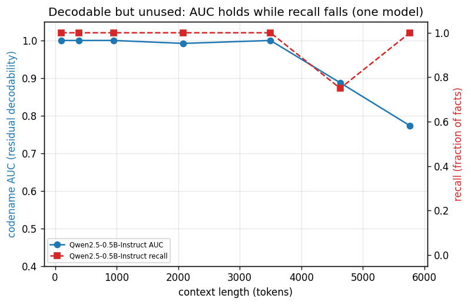
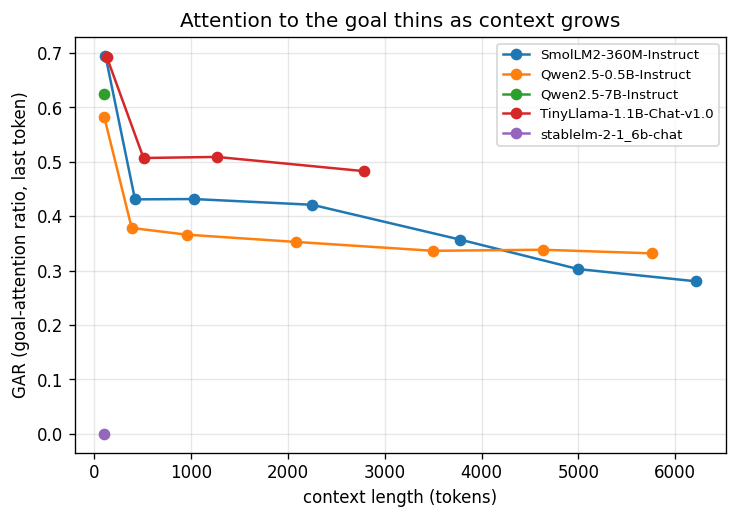
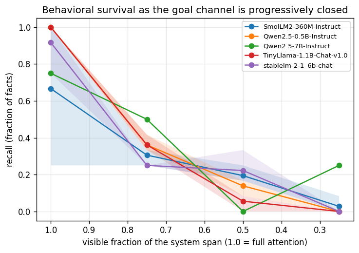
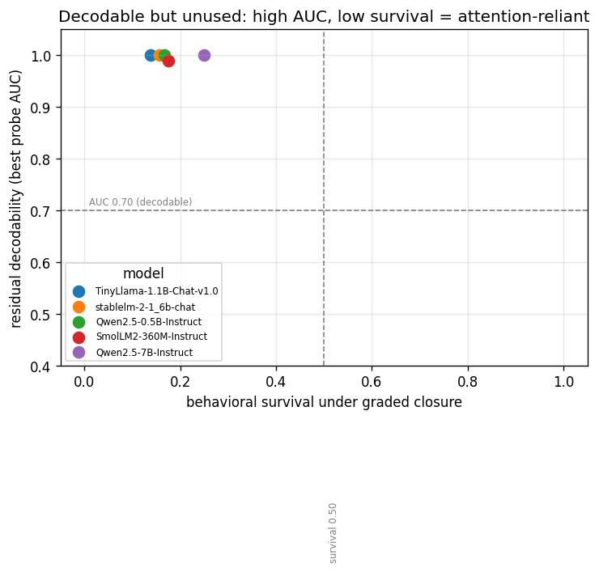

# Sample output

Real runs of `demo.py` on `Qwen/Qwen2.5-0.5B-Instruct` (MPS, float32) and the cross-model
modes across five models (360M→7B). Absolute numbers will vary by machine, transformers
version, and model — the point is the *shape* of each result. Framework noise (download
progress bars, HF token notice) is omitted below. Sections: `all` (gar/ablate/probe),
`report`, `dissociate`, `steer`, `compare --stats`, and the `plot` figures.

```text
loading Qwen/Qwen2.5-0.5B-Instruct on mps (torch.float32) ...

========================================================================
  MODE 1: GAR decay — attention thins, then recall finally breaks
========================================================================
turns | ctx tok |  GAR all |   early |    late | recall
------------------------------------------------------------------------
    0 |     103 |   0.5821 |  0.5077 |  0.6874 |    4/4
    8 |     386 |   0.3783 |  0.2556 |  0.5244 |    4/4
   24 |     952 |   0.3660 |  0.2246 |  0.5136 |    4/4
   56 |    2084 |   0.3526 |  0.2143 |  0.4899 |    4/4
   96 |    3499 |   0.3363 |  0.1998 |  0.4617 |    4/4
  128 |    4631 |   0.3383 |  0.2006 |  0.4582 |    3/4
  160 |    5763 |   0.3316 |  0.1942 |  0.4507 |    4/4
------------------------------------------------------------------------
GAR trends down as context grows: the attention channel is closing.
First recall MISS at 128 turns (~4631 tokens), GAR 0.3383: the model
drops a planted fact once attention to the system prompt has thinned.
On a 0.5B model natural failures are sparse and noisy (recall can recover
at longer context) — MODE 2 forces the clean *causal* collapse via ablation.
(early = first third of layers, late = last third.)


========================================================================
  MODE 2: Ablation — close attention to system tokens, totally then gradually
========================================================================
  total closure (channel from every generated token to the system span):
                    fact |   normal |  ablated
    --------------------------------------------
        project codename |       OK |     MISS
            lead auditor |       OK |     MISS
    compliance framework |       OK |     MISS
          launch quarter |       OK |     MISS
    --------------------------------------------
    recall: normal 4/4 (100%)  ->  ablated 0/4 (0%)

  graded closure (avg over orders ('strided', 'suffix', 'prefix') x 3 filler seeds; recall as more of the system prompt is hidden):
     visible |  strided |   suffix |   prefix |  mean
    -----------------------------------------------------
        0.75 |     0.50 |     0.50 |     0.08 |  0.36
        0.50 |     0.25 |     0.00 |     0.17 |  0.14
        0.25 |     0.00 |     0.00 |     0.00 |  0.00
    -----------------------------------------------------
  survival under partial closure: 0.17 (seed band [0.17, 0.17]). Total closure collapses recall;
  how much survives the *graded* closure is what separates architectures (see `compare`).


========================================================================
  MODE 3: Residual probe — the planted goal survives in the hidden states
========================================================================
  samples=32  classes=4 (codename values)  layers=24
------------------------------------------------------------------------
  residual stream (layer  2)      : AUC 0.500
  residual stream (layer 12)      : AUC 0.990
  residual stream (layer 22)      : AUC 1.000
  input embeddings  (layer  0)      : AUC 0.500  (chance — last-token input is identical across classes)
------------------------------------------------------------------------
The planted codename is decodable from the residual stream far above the
embedding baseline: the value survives in the hidden state even as the
attention channel to the system prompt thins.

logged 15 metric docs to local://lost_track_db (run_id b52653f7) — run `python3 demo.py report` to aggregate across runs.
```

## `report` mode (MongoDB aggregations over stored runs)

Every run logs its measurements to an embedded smongo store; `python3 demo.py report` runs
aggregation pipelines over them. By default it scopes to the **latest run per model**, so
re-running `all` never inflates or blends the numbers (ablation is shown as a per-fact
rate, `ok/facts`):

```text
========================================================================
  REPORT: MongoDB aggregations over stored runs
========================================================================
  scope: latest run per model (use --all-runs for full history)
  15 documents across 1 model(s): Qwen/Qwen2.5-0.5B-Instruct

  GAR decay (max -> min) and context reached:
                           model |  max GAR |  min GAR | max turns
      Qwen/Qwen2.5-0.5B-Instruct |   0.5821 |   0.3316 |       160

  First recall MISS (crossover turn):
                           model | first miss turn | GAR there
      Qwen/Qwen2.5-0.5B-Instruct |             128 |    0.3383

  Ablation recall (rate over facts, normal vs ablated):
                           model |   normal |  ablated | facts
      Qwen/Qwen2.5-0.5B-Instruct |     1.00 |     0.00 |     4

  Best probe AUC (residual vs embedding baseline):
                           model |      repr | best AUC
      Qwen/Qwen2.5-0.5B-Instruct | embedding |    0.500
      Qwen/Qwen2.5-0.5B-Instruct |  residual |    1.000
```

Run `demo.py all` a second time and the default report still reads `facts | 4` (latest run
only) — the numbers don't double. `python3 demo.py report --all-runs` aggregates the full
history instead (here, two runs -> `facts | 8`), while the rates and min/max GAR stay
stable; `--run <run_id>` scopes to a single run. Re-running with `--model <other>` makes the
report aggregate across models.

## `dissociate` mode (decodable but unused, one model)

`python3 demo.py dissociate` measures GAR, behavioral recall, and codename AUC at matched
context lengths on Qwen2.5-0.5B:

```text
========================================================================
  DISSOCIATE: decodable but unused — AUC holds while recall falls (one model)
========================================================================
turns | ctx tok |  GAR all | recall | codename AUC
------------------------------------------------------------------------
    0 |     103 |   0.5821 |    4/4 |        1.000
    8 |     386 |   0.3783 |    4/4 |        1.000
   24 |     952 |   0.3660 |    4/4 |        1.000
   56 |    2084 |   0.3526 |    4/4 |        0.992
   96 |    3499 |   0.3363 |    4/4 |        1.000
  128 |    4631 |   0.3383 |    3/4 |        0.887
  160 |    5763 |   0.3316 |    4/4 |        0.773
------------------------------------------------------------------------
```

As context grows, GAR falls and recall starts to MISS (3/4 at ~4.6k tokens) while the codename
stays decodable (AUC well above the 0.50 embedding baseline) — present in the hidden state but
no longer used.

## `steer` mode (re-inject the goal, recall returns)

`python3 demo.py steer` builds a diff-of-means direction for the planted codename and generates
under total closure while adding it back at the decision point:

```text
========================================================================
  STEER: re-inject the closed-off goal direction and watch recall return
========================================================================
  steering layer 22 (best probe AUC 1.000); typical residual norm ~60.5

  recall of 'Halcyon' under TOTAL closure vs steering strength:
    coef(xnorm) | recall |                             reply (head)
    ----------------------------------------------------------------
           0.00 |   MISS | I'm sorry, but I need more context to pr
           0.25 |   MISS | I'm sorry, but I need more context to pr
           0.50 |     OK |                                 Halcyon.
           0.75 |     OK |                                 Halcyon.
           1.00 |     OK |                                 Halcyon.
           2.00 |     OK |                                 Halcyon.
    ----------------------------------------------------------------
```

Recall is 0 with the channel closed and returns the instant the goal direction is injected — a
causal confirmation that the goal was present but unused.

## `compare --stats` mode (cross-architecture dissociation + statistics)

After logging several models (`demo.py all --model <name>`, using `--max-turns` to cap the
sweep for larger ones; the 7B with `--dtype bfloat16 --light`), `python3 demo.py compare`
lines up each model's dissociation signature. Captured across five models spanning 360M→7B and
four families:

```text
========================================================================
  COMPARE: cross-architecture dissociation (residual survival vs behavior)
========================================================================
  scope: latest run per model (use --all-runs for full history)
  5 model(s): SmolLM2-360M-Instruct, Qwen2.5-0.5B-Instruct, Qwen2.5-7B-Instruct, TinyLlama-1.1B-Chat-v1.0, stablelm-2-1_6b-chat

                     model | res AUC | emb AUC | normal |  ablat |  surv |   seed band |  miss@ |            reliance
  --------------------------------------------------------------------------------------------------------------------
     SmolLM2-360M-Instruct |   0.990 |   0.500 |   1.00 |   0.00 |  0.18 | [0.17,0.19] |      0 |   attention-reliant
     Qwen2.5-0.5B-Instruct |   1.000 |   0.500 |   1.00 |   0.00 |  0.17 | [0.17,0.17] |    128 |   attention-reliant
       Qwen2.5-7B-Instruct |   1.000 |   0.500 |   0.75 |   0.00 |  0.25 | [0.25,0.25] |      0 |   attention-reliant
  TinyLlama-1.1B-Chat-v1.0 |   1.000 |   0.500 |   1.00 |   0.00 |  0.14 | [0.11,0.17] |      0 |   attention-reliant
      stablelm-2-1_6b-chat |   1.000 |   0.500 |   1.00 |   0.00 |  0.16 | [0.14,0.19] |   none |   attention-reliant
```

`--stats` adds the cross-run statistics (full history). Greedy decoding with fixed seeds makes
each run's survival deterministic, so the CIs are ~`±0.00` (highly reproducible), and the
permutation test is underpowered at N=2 runs (its p-value floor is ~0.33), so it shows no
significant pairwise differences yet — a power limitation, not evidence of none:

```text
  Multi-run survival statistics (per-run survival = mean graded-closure recall ...):
                       model | mean surv |    95% CI | runs
       SmolLM2-360M-Instruct |     0.176 |  +/-0.000 |    2
       Qwen2.5-0.5B-Instruct |     0.167 |  +/-0.000 |    2
         Qwen2.5-7B-Instruct |     0.250 |       n/a |    1
    TinyLlama-1.1B-Chat-v1.0 |     0.139 |  +/-0.000 |    2
        stablelm-2-1_6b-chat |     0.157 |  +/-0.000 |    2

  Pairwise permutation test (two-sided, 10k iters, seed 0) on mean survival:
    ... all pairs p ~ 0.33 (the N=2 floor) ...
```

**Honest result:** the graded-closure survival is a real, differentiated, seed-stable axis
(0.14–0.25 across models) rather than being pinned at 0 by total ablation — yet **all five sit
below the survival threshold and bucket as `attention-reliant`**: the goal is decodable from the
residual stream (AUC ~0.99–1.0) but recall falls away as attention to it is closed. Two
controlled flip tests both failed: **scaling Qwen 0.5B → 7B** (survival only 0.17 → 0.25) and
**swapping to a different family, StableLM-2** (0.16). No model crosses into `residual-reliant`,
so the architectural *divergence* the paper reports does not appear at this scale. That negative
is reported as-is.

Regenerating these numbers also re-caught a real trap: StableLM-2's chat template renders a
*lone* system message to nothing, so the span detector returns an empty system span — which
makes the ablation a silent no-op and reports a fake `survival` of ~1.0 (a spurious "flip"). The
store actually held two such early StableLM runs (total-closure recall stuck at 4/4); they were
spotted by exactly that signature and discarded, and the fixed run collapses to 0/4 like the
rest. A span fallback plus a guard that skips any model whose goal span can't be located now
prevent it. (StableLM-2 is run with `--max-turns 0`, hence `miss@ none`; the 7B with
`--dtype bfloat16 --light` — bf16 because fp16 overflows in eager attention on MPS.)

## Figures (`python3 demo.py plot --all-runs`)

`plot` renders these from the stored runs (no model load) into `figures/`:

The within-model dissociation — codename AUC stays high while recall falls as context grows:



GAR decaying with context (the attention channel closing), per model:



Behavioral survival as the goal channel is progressively closed — all models collapse:



Residual decodability vs survival — every model is high-AUC, low-survival (attention-reliant):



## How to read it

- **GAR decay, then a behavioral MISS.** `GAR all` drops from 0.58 to ~0.33 as the
  context grows from 103 to 5,763 tokens — the attention channel onto the system prompt is
  thinning, and the `early`/`late` split shows the early layers thin faster. Recall stays
  4/4 until the first MISS at 128 turns (~4,631 tokens), where the model drops the launch
  quarter. The failure is genuine but sparse and non-monotonic (recall is 4/4 again at
  5,763 tokens): on a 0.5B model natural attention decay rarely produces a clean collapse,
  which is why MODE 2 induces it causally. GAR here is measured memory-safely at the final
  token (`Model.gar_last_token`), so the sweep can reach multi-thousand-token context
  without materializing O(L^2) attention across all layers.
- **Ablation.** With normal attention the model recalls every fact (4/4). *Total* closure
  (whole system span masked) drops recall to 0/4. *Graded* closure — hiding a fraction of the
  system prompt — traces the curve in between, averaged over three mask orderings and three
  filler seeds so the `survival` axis reflects the goal channel (not fact position) and comes
  with a seed band. Its mean recall is the `survival` axis `compare` uses. Both runs complete
  with no NaN (the finite-logits guard passed), so the collapse is the manipulation, not a
  numerical artifact.
- **Residual probe.** The planted codename is undecodable at layer 2 (AUC 0.500), then
  becomes almost perfectly decodable by layers 12 and 22 (0.990 / 1.000), while the
  input-embedding baseline stays at chance (0.500) because the final-token input is
  identical across classes. That gap is the paper's point reproduced in miniature: the
  goal survives in the residual stream, and the layer where it emerges is well above the
  input.
- **Dissociation.** `dissociate` puts all three signals on the same context: AUC stays high
  (0.77–1.0) while recall drops to 3/4 as GAR falls — the goal is decodable but unused.
- **Steering.** `steer` confirms it causally: recall is 0 under closure and returns to
  "Halcyon." once the decoded goal direction is re-injected at the decision point.

The model-free smoke test (`python3 test_demo.py`) covers the GAR math, the ablation-mask
invariants, the memory-aware GAR-sweep cap, the MongoDB aggregations (crossover, latest-run
scoping — including that auxiliary `steer`/`dissociate` runs don't shadow the full run — and
the cross-architecture dissociation/classifier), the multi-run survival stats, the permutation
test, the steering-vector math, and a `plot` smoke test — all without any download or inference.
```text
[warn] metric not logged: disk on fire
ok  test_ablation_mask_has_no_all_inf_rows
ok  test_ablation_mask_shape_and_columns
ok  test_classify_reliance_buckets
ok  test_compare_dissociation
ok  test_crossover_by_model_aggregation
ok  test_gar_per_layer_matches_hand_calc
ok  test_gar_schedule_caps_by_model_size
ok  test_gar_tracks_span_mass
ok  test_latest_scope_ignores_auxiliary_modes
ok  test_log_metric_is_best_effort
ok  test_partial_ablation_mask_endpoints_match_for_every_order
ok  test_partial_ablation_mask_order_chooses_which_columns_survive
ok  test_permutation_test_determinism_and_separation
ok  test_plot_smoke
ok  test_report_scope_latest_run
ok  test_steering_vector_diff_of_means
ok  test_survival_across_runs_stats

17 passed
```
